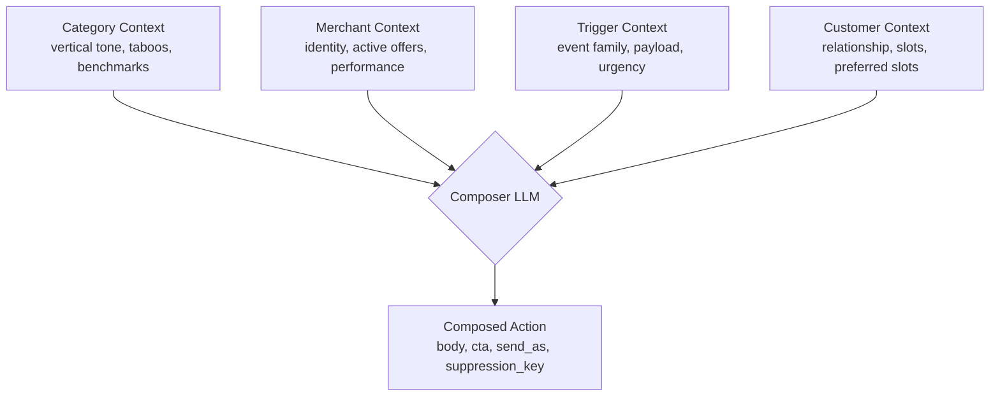
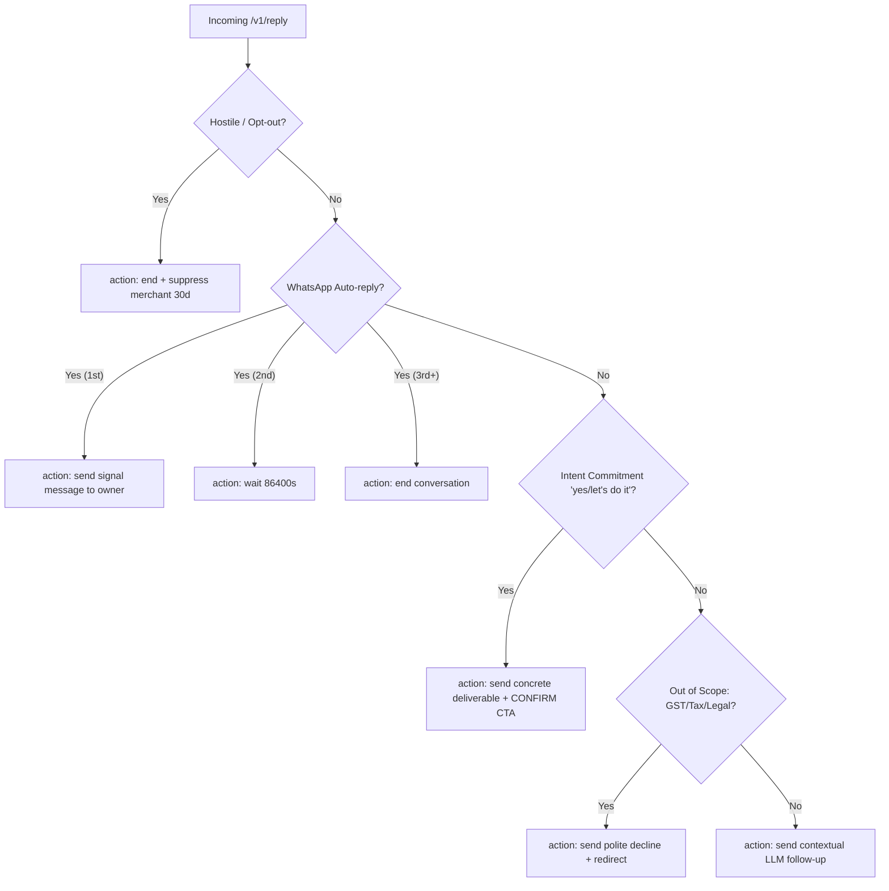

# Vera Bot — magicpin AI Challenge Submission

## Approach

**Core idea**: Every trigger kind deserves its own prompt variant. A `research_digest` needs clinical source-citation framing. A `recall_due` needs slot-offering patient-context framing. A `perf_dip` needs data-anchored, contrarian reasoning. A generic prompt handles none of these well — so I dispatched on `trigger.kind` and wrote specialized prompts for each of the 22+ trigger kinds in the dataset.

## Architecture

```
POST /v1/context  →  in-memory context store (scope, context_id) → {version, payload}
POST /v1/tick     →  sort triggers by urgency → compose() for each → return actions[]
POST /v1/reply    →  classify reply → route to: end/wait/action/followup handler
GET  /v1/healthz  →  uptime + context counts
GET  /v1/metadata →  bot identity
```



### Composition pipeline (`composer.py`)
1. `compose(category, merchant, trigger, customer?)` called per trigger
2. `prompts.py` builds a **system prompt** (category voice rules, taboos, CTA style, trigger-kind instructions) + **user prompt** (full context summary with real numbers)
3. Groq `openai/gpt-oss-120b` at temperature=0, `reasoning_effort="low"` for determinism
4. Output parsed as JSON → validated (no URLs, correct send_as, valid CTA)
5. Retry once with a bigger token budget if reasoning truncated the response; last resort is a fact-carrying fallback prompt (never fact-free)

### Known issues found and fixed this pass

The submission originally scored 52/100. Investigation traced it to two structural bugs, both fixed:

1. **Reasoning-token starvation → fabrication.** `openai/gpt-oss-120b` is a reasoning model — it spends tokens on hidden chain-of-thought before writing the JSON answer. At the original `max_tokens=800` with no `reasoning_effort` cap, reasoning alone exhausted the budget in ~4/5 calls (`finish_reason="length"`, empty `content`). `compose()` then silently fell back to `_build_fallback_prompt`, which at the time carried **no grounding facts at all** — so the model fabricated plausible-sounding but entirely invented statistics instead of using the real digest/merchant data already in context. Fix: `reasoning_effort="low"` + `max_tokens=1600` (with a bigger-budget retry on truncation), and the fallback prompt now always carries the real merchant/trigger/digest facts as a last line of defense.
2. **TPM rate limiting silently dropping triggers.** This Groq key's org-wide limit is 8000 tokens/min across all chat models. Firing many triggers concurrently (the original `max_workers=8`) reliably hit 429s that `main.py` swallowed — the trigger simply produced no action, with no retry. Worse, creating a fresh `ThreadPoolExecutor` per `/v1/tick` call let abandoned in-flight calls from one tick keep competing with the next tick's fresh calls, which could starve a subsequent tick down to zero successes. Fixed with: a single shared, bounded executor (`max_workers=3`) reused across requests; a bounded retry-on-429 in `composer.py`; an `in_flight_keys` set so overlapping ticks never submit duplicate work for the same trigger; and a hard wall-clock deadline (`TICK_WALL_CLOCK_BUDGET_S=18s`) so `/v1/tick` always returns well inside the harness's 30s timeout regardless of rate-limit conditions. Net effect: throughput per tick is capped by the account's real TPM budget (not all 20 triggers can be composed in one 30s window), but nothing is lost — unprocessed triggers are safely retried on a later tick, not repeated as wasted duplicate calls.

A smaller but real third issue: `_context_summary()` used to fall back to `digest[0]` whenever a trigger's payload had no `top_item_id`, injecting an unrelated research finding into totally unrelated triggers (e.g. a `perf_dip` message would non-sequitur into a fluoride-recall study as if it were the fix). Fixed by only surfacing a digest item on an actual `top_item_id` match. Also hardened the `gbp_unverified` prompt and added an explicit "no placeholder tokens" rule after observing a literal `"(payload)"` and a fabricated `"N merchants"` leak into one output.

### What makes each dimension score well

| Dimension | Design decision |
|---|---|
| **Specificity** | Context summary passes merchant's exact CTR, view counts, peer benchmark, active offer prices, digest trial_n and source citations directly into the prompt |
| **Category fit** | `CATEGORY_VOICE` dict in `prompts.py` — each category has tone, salutation format, vocabulary style, taboos, CTA style, and example phrases |
| **Merchant fit** | Owner first name always used. Active offers only (expired filtered). Language preference passed. Conversation history included in context. |
| **Trigger relevance** | `TRIGGER_INSTRUCTIONS` dict — each trigger kind has dedicated instructions that lead with "WHY NOW" and reference the specific payload fields |
| **Engagement compulsion** | Prompt requires 1-3 compulsion levers: specificity, loss aversion, social proof, effort externalization, curiosity, or reciprocity. Single CTA last. |

### Reply handling (`conversation.py` + `main.py`)


- **Auto-reply**: Pattern-matched against 15+ canned phrases. Turn 1 → signal message. Turn 2 → wait 24h. Turn 3+ → end.
- **Intent commitment**: Detected via regex ("yes", "let's do it", "chalega", "thik hai", etc.). Routes immediately to action composition — no qualifying questions.
- **Hostile / opt-out**: Detected + merchant suppressed for session. Graceful `end`.
- **Out-of-scope**: GST, taxes, legal, loans → politely declined + redirected.
- **Normal**: Full contextual follow-up composed via LLM.

## Model choice

**Groq + openai/gpt-oss-120b**: free-tier reasoning model, handles Hindi-English code-mix well and follows the grounding rules reliably once `reasoning_effort` and `max_tokens` are tuned correctly (see "Known issues" above). `llama-3.3-70b-versatile` / `llama-3.1-8b-instant` are no longer available on Groq's catalog for this key — every chat-capable model on this account shares the same 8000 TPM org-wide cap, so switching models doesn't relax the rate-limit constraint described above.

## Tradeoffs

- In-memory state (no Redis) — suitable for a 60-min test window; would use Redis for production
- Single LLM call per composition — faster than multi-step but slightly less nuanced than chain-of-thought
- Suppression dedup is per-session — if bot restarts, suppression resets (not a concern here)

## What additional context would have helped most

1. **Exact merchant time zone** — needed for precise slot labels in recall messages
2. **Real slot availability** — recall/appointment triggers reference slots but don't always have them; I use trigger payload slots when available, otherwise generic slot labels
3. **Merchant's current Google post cadence** — would enable tighter "you haven't posted in X days" hooks

## Local testing

```bash
# 1. Install dependencies
pip install -r requirements.txt

# 2. Set API key
cp .env.example .env
# Edit .env and add your GROQ_API_KEY

# 3. Run bot
uvicorn main:app --host 0.0.0.0 --port 8080

# 4. In another terminal, run the judge simulator
cd ..
python judge_simulator.py
```

